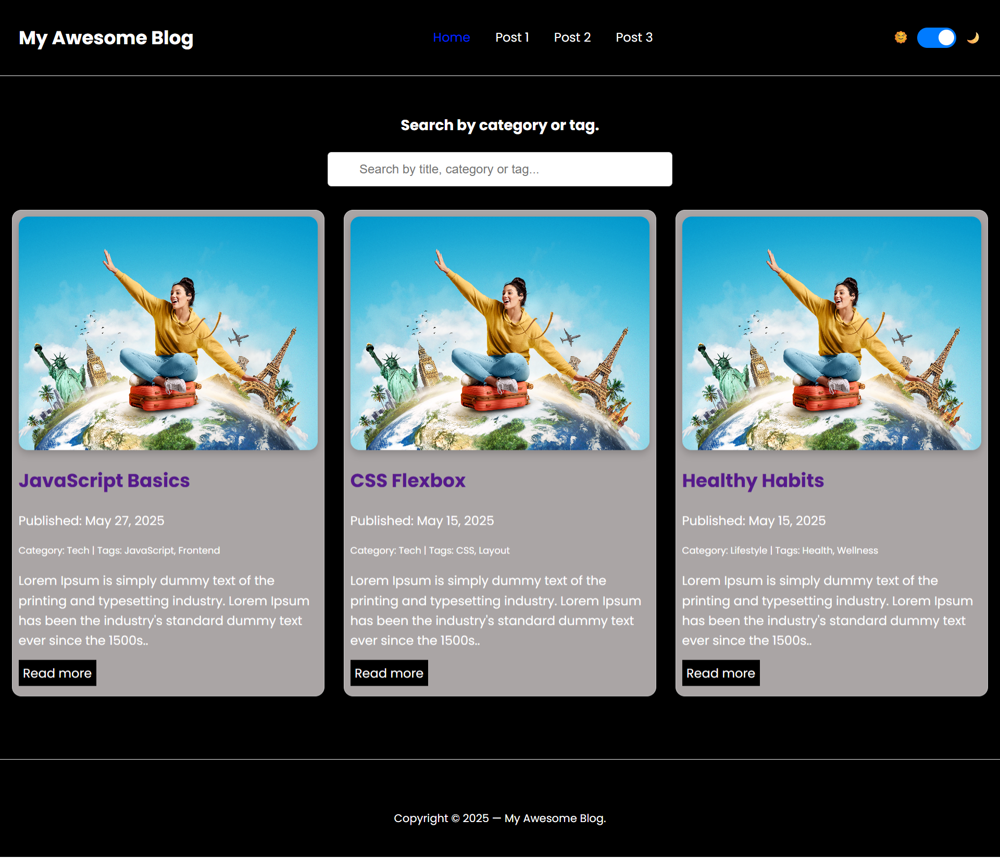

# 🌐 My Awesome Blog Website

A responsive blog website built using **HTML**, **CSS**, and **JavaScript**.  The blog features dynamic filtering of posts using a **search bar** filter by **categories**, **tags** and **title**. It includes **Dark** and **Light** mode to change the website theme with comment option. Designed for performance and readability.

---

## 📸 Preview

 and (./assets/images/Blog-Website-light-mode.png)
** Home page preview

---

## 🛠️ Technology used

- **HTML** – Structure
- **CSS** – Styling and responsive design
- **JavaScript** – Interactivity (search filter, category/tags logic, comments)

---

## 🚀 Features

- Responsive blog layout
- Blog post cards with title, date, category, tags and excerpt
- Category & tag based search filter
- Header with navigation and search bar
- Comment section using localstorage
- Dark and light mode toggle
- Social Share feature

---

## 📁 Folder Structure
/blog-website
│
├── index.html 
├── styles.css
├── script.js
├── assets/
│ └── images
|   └── all images
├── posts
| └── post1.html
| └── post2.html
| └── post3.html
|     
└── readme.md

---

## 📌 How to Run

1. Download or clone the repository:
git clone (https://github.com/sadindore90/blog-website.git)

2. Open `index.html` in your browser.
> No build tools or backend required, it's a static website.

3. Optional (Recommended): Use a Local Server
If you're having issues with local image loading:

a) With VS Code:
Install Live Server extension

Right-click index.html → "Open with Live Server"

b) Use http-server with Node.js
Step-by-step:
1. Install Node.js (if not already):
https://nodejs.org/

2. Install http-server:
npm install -g http-server

3. Run it in your project folder:
cd your-project-folder
http-server

4. You’ll see something like:
Starting up http-server on http://127.0.0.1:8080

5. Open the browser and go to http://127.0.0.1:8080

---

## 🙌 Acknowledgements

- Icons by [Font Awesome](https://fontawesome.com/)
- Fonts by [Google Fonts](https://fonts.google.com/)

---

## 🙋‍♀️ Author

Shalini Gupta
[LinkedIn](https://www.linkedin.com/in/shalini-gupta-8614877b/) 
[GitHub] (https://github.com/sadindore90/blog-website)

